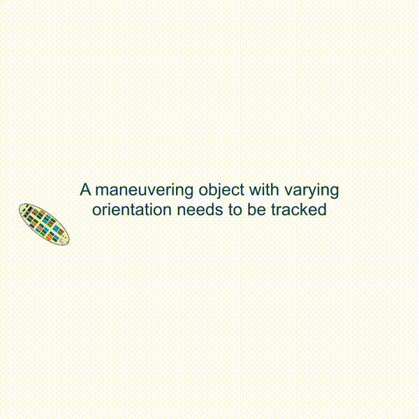

# Extended Object Tracking by Rao-Blackwellized Particle Filtering for Orientation Estimation

This repository contains the implementation of the MEM-RBPF along with code for reproducing the experiments.

Publication:

```
S. Steuernagel and M. Baum, 
"Extended Object Tracking by Rao-Blackwellized Particle Filtering for Orientation Estimation," 
in IEEE Transactions on Signal Processing, doi: 10.1109/TSP.2025.3574689
```

Direct Link: [https://ieeexplore.ieee.org/document/11017463](https://ieeexplore.ieee.org/document/11017463)



## This repository

The implementation of the MEM-RBPF tracker can be found
at [src/trackers_elliptical/mem_rbpf.py](src/trackers_elliptical/mem_rbpf.py).

To reproduce the quantitative evaluation, take a look
at [src/experiments/compare_quant.py](src/experiments/compare_quant.py).

To reproduce the example images, use this
script: [src/experiments/compare_trackers.py](src/experiments/compare_trackers.py).

Please note that due to potential version mismatch etc., a 1:1 match of the seeding and hence the individual results can
not be guaranteed. However, averaged across Monte Carlo runs, results should be what is presented in the paper.

All output will be saved to the [output/results](output/results) directory. Scripts for generating results (in `.npy`
format) and for visualization of results are separated.